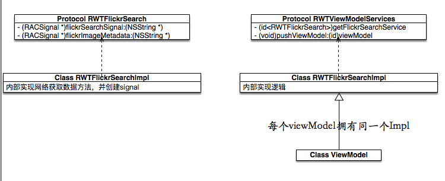

# RWTFlickrSearch
MVVM+RAC

[MVVM Tutorial with ReactiveCocoa: Part 1/2](https://www.raywenderlich.com/74131/mvvm-tutorial-with-reactivecocoa-part-1)

[MVVM Tutorial with ReactiveCocoa: Part 2/2](https://www.raywenderlich.com/74131/mvvm-tutorial-with-reactivecocoa-part-2)

##懵逼
RAC很多东西都在刷新我的世界观。不过确实把相关的逻辑更紧凑了。

简单的做了下逻辑整理

##随意
- UIbutton 有rac_command，不过只能响应UIControlEventTouchUpInside。要响应其他事件可以是使用UIControl的rac_signalForControlEvents:。
- 写不出来了。。。
